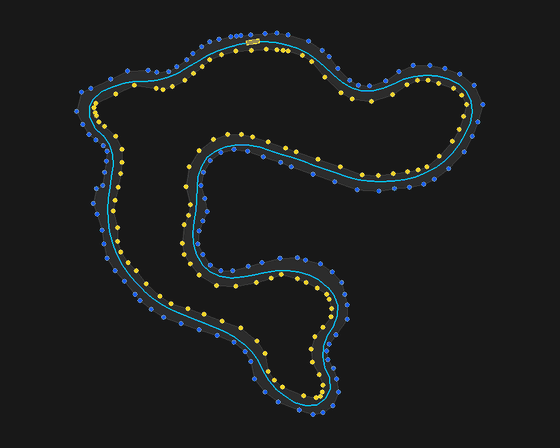

<div align="center">

# HIL Torque Vectoring

**A four-wheel torque-vectoring race car, simulated and controlled entirely in C.**



*One clean lap of the Formula Student Germany 2024 endurance track. Blue and
yellow dots are the boundary cones; the cyan line is the computed racing line;
the red box is the car, leaving a green trail.*

</div>

---

## What this is, in one paragraph

A racing car has four electric motors — one per wheel. **Torque vectoring** is
the trick of feeding each wheel a slightly different amount of power so the car
turns exactly as sharply as the driver is asking, without sliding wide
(understeer) or spinning out (oversteer). This project builds the whole loop in
software: a **physics model** of the car, a **virtual driver** that steers and
sets speed around a real Formula Student track, and the **ECU control algorithm**
that does the torque vectoring. They run together 100 times a second, and a live
visualiser shows the car driving the lap you see above.

It is structured as a **Hardware-in-the-Loop (HIL)** test rig: the control code
is walled off so it only ever sees the same sensor data a real car's electronics
would see. That means the exact same algorithm could be flashed onto a real ECU
with no changes — the simulation is standing in for the car.

## Why it's interesting

- **Three real control systems working together** — a model-based LQR steering
  controller, a two-pass speed planner, and a PID-plus-feedforward yaw-moment
  controller — tuned to drive a measured race track cleanly in **~27 seconds**.
- **A genuine physics model**, not a toy: per-wheel nonlinear tyres, aerodynamic
  downforce and drag, weight transfer under braking and cornering, and a grip
  limit on every wheel.
- **A hard software boundary** between "car" and "controller", enforced by the
  build system — the same discipline used to ship code to real embedded hardware.
- **Tested and measured, not eyeballed**: a headless lap evaluator and a unit-test
  suite run in CI, so any change that makes the car slower or sends it off-track
  fails the build automatically.
- **Self-tuning**: an optimiser searches the control gains and rejects any setup
  that only works at one exact point, keeping the car robust to small changes.

## The big idea: torque vectoring

When you turn the steering wheel, you're asking the car to rotate at a certain
rate — its **yaw rate**. A car with one engine can't do much if it rotates too
slowly or too quickly. A car with four motors can: give the **outer** wheels a
bit more push and the **inner** wheels a bit less, and the difference twists the
car into the corner. Do the opposite and you straighten it up.

```
        Understeer (nose runs wide)         Torque vectoring fixes it
        ───────────────────────────         ─────────────────────────
              wanted path                          wanted path
                 ╱                                     ╱
                ╱   actual path                       ╱  (now matches)
        car →  ╱   ╱                          car →  ╱
              ╱  ╱                                   ╱   outer wheel: more torque
             ╱ ╱                                    ╱    inner wheel: less torque
```

The controller measures how fast the car is *actually* rotating, compares it to
how fast it *should* be rotating, and continuously adjusts the left/right torque
split to close the gap.

---

## How the whole thing fits together

Every tick (100 times a second) the data flows in one direction around a loop:

```
   ┌─────────────────────────────────────────────────────────────┐
   │                                                               │
   │   1. DRIVER  (motion_control.c)                               │
   │      • looks at the racing line ahead                         │
   │      • picks a steering angle (LQR)                           │
   │      • picks a target speed from the upcoming corner          │
   │      • asks for a total torque                                │
   │                          │                                    │
   │                          ▼   (only sensor data crosses here)  │
   │   2. ECU  (torque_vectoring.c)                                │
   │      • reads speed, yaw rate, steering, wheel speeds          │
   │      • splits that total torque four ways to vector the car   │
   │                          │                                    │
   │                          ▼                                    │
   │   3. CAR  (vehicle_model.c)                                   │
   │      • applies four wheel torques + steering                  │
   │      • computes tyre forces, updates position & speed         │
   │                          │                                    │
   │                          ▼                                    │
   │   4. TRACK                                                    │
   │      • advances along the lap, counts laps                    │
   │                          │                                    │
   └──────────────────────────┘  → STATE line streamed to the visualiser
```

The three roles live in **separate files on purpose**, mirroring how a real team
splits "the car", "the driver", and "the control electronics".

---

## The maths, in plain language

You don't need the equations to follow this — each one is one short idea.

### 1. The racing line — find the smoothest path through the cones

The track is just a list of cone positions. Before the car moves, the planner
builds the line it will follow, in three steps:

1. **Pair the cones up** — match each left cone to its nearest right cone to find
   the "gates" the car must drive through.
2. **Find the middle** — take the midpoint of each gate and space them evenly,
   2.5 m apart, to get a centreline.
3. **Smooth it out** — nudge the line side to side *inside* the cones to make it
   as gently curved as possible. A straighter line through a corner means a wider
   arc, and a wider arc means **you can take it faster**.

### 2. Corner speed — how fast can a corner be taken?

A corner is a circle of some radius. The grip of the tyres caps how hard the car
can pull sideways. That gives a simple speed limit for every point on the line:

> **corner speed = √( grip × corner radius )**

Tighter corner (small radius) → lower speed. This single rule, applied to the
whole line, is what decides the lap time.

### 3. The speed plan — brake early, accelerate late

Knowing the speed limit at every point isn't enough — you also have to **brake in
time**. The planner makes two passes over the line:

- **Forward pass:** set each point to its corner-speed limit.
- **Backward pass:** starting from each slow corner, walk *backwards* and pull the
  speed down earlier and earlier, so the car is already slow enough by the time it
  arrives. This is exactly how a human brakes *before* the corner, not in it.

### 4. Steering — the LQR controller

This is the cleverest part. At every instant the controller knows two errors:

- **e₁** — how far the car is *sideways* off the line (cross-track error).
- **e₂** — how much the car is *pointing the wrong way* (heading error).

An **LQR** (Linear-Quadratic Regulator) is an optimal controller: given a model of
how steering affects those two errors, it computes the *single best* steering
angle that drives both errors to zero with the least wasted effort. Because the
car behaves differently at 20 km/h than at 70 km/h, the controller **recomputes
its gains as the speed changes**. On top of that it adds:

- a **feedforward** term that pre-bends the steering for the corner it can already
  see coming, so it doesn't have to wait for an error to appear, and
- a small **integrator** that wipes out any tiny, persistent offset.

The result: the car stays within **~9 cm** of the ideal line, all the way round.

### 5. Torque vectoring — the ECU's job

This is the algorithm that would run on the real car's control unit. Step by step:

**a. How fast *should* the car be rotating?** From the steering angle and speed:

> **wanted yaw rate = speed × tan(steering) / (wheelbase + understeer × speed²)**

The `speed²` term is honest about the fact that fast cars can't rotate as sharply
as the geometry alone suggests.

**b. How fast *is* it rotating?** Blend two sensors: the gyro (IMU), and a second
estimate from the fact that the outer wheels spin faster than the inner ones in a
corner. Two independent measurements are more trustworthy than one.

**c. Pre-load the corner (feedforward).** The instant the steering moves, start
shifting torque outward — don't wait for an error. This is the single biggest
contributor to clean cornering.

**d. Correct the rest with PID feedback:**

> **bias = feedforward + Kp·error + Ki·∫error + Kd·(rate of change of error)**

- **Kp** reacts to the error right now (and is reduced at high speed for stability).
- **Ki** patches a small, stubborn error that never quite goes away.
- **Kd** damps the turn-in so the car doesn't overshoot.

**e. Split it across four wheels.** The base torque is shared equally; the
vectoring bias is then split front/rear, with **more to the rear** (the rear tyres
are doing less steering work, so they have more grip to spare for vectoring).

**f. Respect the motors.** Each wheel is clamped to what its motor can deliver
(+29.4 Nm driving, −100 Nm regenerative braking). If the outer wheel maxes out,
the leftover is pushed onto the inner wheel so the *turning effect* is preserved
as far as physically possible.

> One neat detail: torque vectoring works **during braking too**. The car has no
> friction brakes — it slows using the motors in reverse (regen) — and the same
> left/right split is applied while braking, so the car is steered with the motors
> on corner entry as well as on corner exit.

### 6. The car — the physics model

So the controller has something realistic to control, the car is a **3-degree-of-
freedom model** (forward, sideways, and rotation) evaluated **per wheel**:

- **Nonlinear tyres** (Pacejka model): grip rises then *falls off* as you ask too
  much of a tyre — the real reason cars slide.
- **Aerodynamics**: downforce presses the car into the track (more grip at speed),
  drag slows it on the straights.
- **Weight transfer**: braking throws weight forward, cornering throws it
  sideways, changing how much grip each individual wheel has.
- **A grip limit per wheel** (the "friction circle"): a wheel can't do maximum
  cornering *and* maximum acceleration at once — spend grip on one and you have
  less for the other.

The numbers match a real **Formula Student M25 car**: 260 kg, 1.55 m wheelbase,
four 29.4 Nm motors through a 15.47:1 gearbox.

---

## See it run

**1. Build the C simulation** (needs `gcc` and `make`; use MSYS2 on Windows):

```
make
```

This produces `HIL_Firmware/build/hil_sim`.

**2. Run the live visualiser** (needs Python 3 and pygame):

```
pip install pygame
python visualiser.py
```

The visualiser launches the simulation itself and opens a window with the track
on the left and a live telemetry panel on the right — speed vs. target, yaw rate,
an understeer/oversteer bar, a slip gauge, a G-G (friction-circle) plot, and a bar
chart of the four wheel torques.

| Key | Action |
|-----|--------|
| `T` | Toggle torque vectoring **on / off** — watch the lap time change |
| `[` `]` | Decrease / increase the TV gain |
| `M` | Map view ↔ follow-cam |
| `F` | Fullscreen |
| `Q` / `Esc` | Quit |

**Things worth trying:** press `T` to turn torque vectoring off and watch the four
torque bars go equal and the lap time get worse; press `]` to crank the gain and
watch the car get twitchy. The header GIF was made with `python tools/make_track_gif.py`.

---

## How it's tested

This isn't judged by eye. Every change is measured.

```
make test     # unit tests: signs, clamping, anti-windup, the HIL boundary
make eval     # drives a full headless lap and reports the metrics
```

`make eval` runs the entire driver → ECU → car loop over the real track as fast as
the machine allows and prints a lap report ending in a machine-readable `RESULT`
line. A good change keeps **off-track ticks at zero**, **completes the lap**, and
doesn't make the lap slower or the line sloppier. **CI runs both on every push and
fails the build if the car can't get round** — so a control regression can't slip
in unnoticed.

The control gains are tuned by `tools/tool_smart_sweep_lqr.py`, an optimiser that
scores each candidate setup by its **worst nearby neighbour**, not its best case.
That deliberately rejects "knife-edge" tunes that only lap cleanly at one exact
point — the kind that look great in a benchmark and fail the moment anything
drifts. The shipped gains lap **two** different tracks cleanly and survive ±3%
jitter on every parameter.

---

## Project layout

```
HIL-Torque-Vectoring/
├── Makefile                    Builds the sim, tests, and tools
├── visualiser.py               Live pygame window (launches the sim)
│
├── shared/                     Code BOTH the car and the ECU may use
│   ├── tv_interface.h          The data types that cross the HIL boundary
│   ├── vehicle_config.h        Physical constants (mass, geometry, tyres)
│   └── parameters_config.h     Tunable parameters (speed budget, TV gains)
│
├── HIL_Firmware/               The "car" side — the simulation
│   └── src/
│       ├── main.c              The 100 Hz sim loop; streams STATE lines
│       ├── vehicle_model.c     Per-wheel physics
│       ├── path_planning.c     Builds the racing line from the cones
│       ├── motion_control.c    The virtual driver (steering + speed)
│       ├── lqr_steer.c         The model-based LQR steering law
│       └── track_parser.c      Loads a cone layout, selectable at runtime
│
├── ECU_Firmware/               The "controller" side — only sees sensor data
│   └── src/torque_vectoring.c  The torque-vectoring algorithm
│
├── tracks/                     Cone layouts as YAML (fsg2024, fse2024)
├── tests/                      Unit tests  (make test)
└── tools/                      Lap evaluator, optimiser, GIF maker, CI helpers
```

**The HIL boundary is enforced by the build.** `torque_vectoring.c` is compiled
with *only* its own header and `shared/` on the include path, so it physically
cannot reach into the simulation's code — exactly as it couldn't on real hardware.

Tracks are swappable at runtime: `TRACK=fse2024 python visualiser.py` (or
`TRACK=fse2024 make eval`). Drop a new `tracks/<name>.yaml` in and rebuild to add
your own.

---

## What's deliberately left out

To stay readable rather than be a full commercial simulator, this models the
control problem honestly but skips: suspension travel and body roll, motor and
inverter electrical dynamics, battery state, and separate friction brakes (the car
brakes on regen only). It's built to show how the control logic works and to test
that the ECU behaves correctly — not to predict real-world lap times to the
millisecond.

---

## Platform notes

- **Visualiser:** Python 3 + pygame (`pip install pygame`).
- **Linux / macOS:** builds with any `gcc`.
- **Windows:** use [MSYS2](https://www.msys2.org) with the MinGW-w64 toolchain:
  ```
  pacman -S mingw-w64-x86_64-gcc make
  ```
  Build with `make` in the MinGW 64-bit shell, then run `python visualiser.py`
  from any terminal with Python on its PATH.
