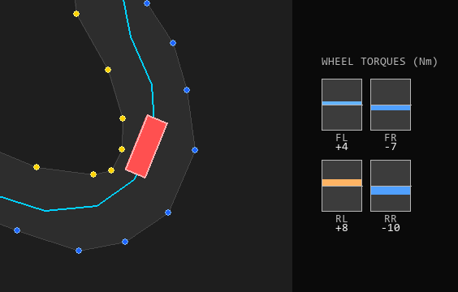
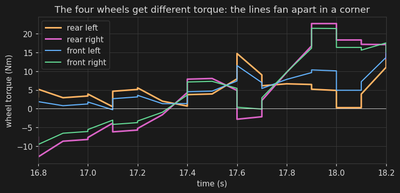
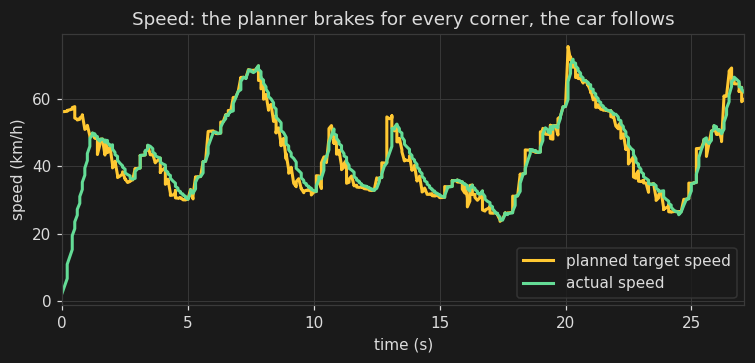

<div align="center">

# HIL Torque Vectoring

**A four-wheel torque-vectoring race car, simulated and controlled in C.**


*One full lap of the Formula Student Germany 2024 track, in real time. The blue
and yellow dots are the boundary cones. The cyan line is the racing line the car
computed before it set off. The red box is the car, with a green trail behind it.*

</div>

---

## What it does

A racing car can have four electric motors, one on each wheel. Torque vectoring
is the trick of giving each wheel a slightly different amount of power so the car
turns exactly as much as the driver wants. Give the outer wheels more push and the
inner wheels less, and the car rotates harder into the corner. Do the opposite and
it straightens up.

This project builds the whole thing in software:

- a **model of the car** and its tyres,
- a **virtual driver** that steers and sets the speed around a real race track,
- and the **control code** that does the torque vectoring.

They all run together 100 times a second. A visualiser then draws the car going
round, which is what you see in the picture above.

The code is split the way a real team would split it. The car, the driver, and the
control unit are kept in separate files, and the control code is walled off so it
only ever sees the same sensor readings a real car's electronics would get. That
is what **Hardware-in-the-Loop (HIL)** means: the simulation stands in for the real
car, so you can test and tune the control code without one.

## Why I think it is worth a look

- Three control systems work together to drive a measured race track in about
  **27 seconds** with no mistakes: a steering controller, a speed planner, and the
  torque-vectoring controller.
- The car model is real, not a toy. It has per-wheel tyres that grip and then
  slide, downforce and drag from the air, weight shifting under braking and
  cornering, and a grip limit on every wheel.
- The wall between "car" and "control code" is enforced by the build itself. If the
  control code tries to reach into the simulation, the build breaks.
- Nothing is judged by eye. A headless lap test and a set of unit tests run on every
  push, and the build fails if the car gets slower or goes off the track.
- The control gains are found by a search tool that throws away any setup that only
  works at one exact point, so the result stays stable when things drift a little.

---

## The idea behind torque vectoring

When you turn the wheel, you are asking the car to rotate at a certain rate. This
rate is called the **yaw rate**. A normal car with one engine cannot do much if it
is rotating too slowly or too quickly for the corner. A car with four motors can fix
it on the fly.

Without help, the car does not turn enough for a tight corner and runs wide of
where you wanted it to go. The fix is to give the **outer** wheels more torque and
the **inner** wheels less. The difference twists the car further into the corner.
The controller measures how fast the car is really rotating, compares it to how
fast it should be rotating, and keeps adjusting the left and right torque to close
the gap.

Here is the car at the tightest corner of the lap, the hairpin, with the live
torque bars from the visualiser beside it. The outer (left) wheels are driving and
the inner (right) wheels are braking on regen, which is what swings the car round:

<div align="center">

</div>

You can also see it over time. In the real torque readings from one corner, the
four lines start together on the straight, then fan apart through the corner as
each wheel is given its own torque:

<div align="center">

</div>

---

## How the loop fits together

Every tick, which happens 100 times a second, the data moves through four stages in
order. The output of each stage feeds the next, then the cycle repeats.

```
  STAGE 1   DRIVER          motion_control.c
            Looks at the racing line ahead. Picks a steering angle.
            Picks a target speed for the corner coming up. Asks for
            a total amount of torque.
                |
                |   only sensor readings are allowed to cross this line
                v
  STAGE 2   CONTROL UNIT    torque_vectoring.c
            Reads speed, yaw rate, steering, and wheel speeds. Splits
            the total torque into four wheel torques to steer the car
            with power.
                |
                v
  STAGE 3   CAR             vehicle_model.c
            Applies the four torques and the steering. Works out the
            tyre forces and updates where the car is and how fast.
                |
                v
  STAGE 4   TRACK
            Moves the car along the lap and counts laps. Sends one
            line of data to the visualiser, then the loop starts again.
```

---

## The maths, kept simple

You do not need the equations to follow this. Each one is a single short idea.

### 1. Find the racing line

The track is just a list of cone positions. Before the car moves, the planner works
out the line it will follow, in three steps:

1. **Pair the cones.** Match each left cone to its nearest right cone. Each pair is
   a gate the car has to drive through.
2. **Find the middle.** Take the midpoint of each gate and space the midpoints evenly,
   2.5 metres apart. That gives a line down the middle of the track.
3. **Smooth it.** Move the line side to side, but only inside the cones, to make it
   bend as gently as possible. A straighter line through a corner is a wider arc, and
   a wider arc can be taken faster.

### 2. How fast can a corner be taken

A corner is part of a circle. The grip of the tyres sets how hard the car can pull
sideways. That gives a speed limit for every point on the line:

> **corner speed = square root of ( grip times corner radius )**

A tighter corner has a smaller radius, so a lower speed. This one rule, used along
the whole line, is what sets the lap time.

### 3. Plan the speed, so the car brakes in time

Knowing the speed limit at each point is not enough. The car also has to start
braking early. The planner goes over the line twice:

- **Forward pass:** set every point to its corner speed limit.
- **Backward pass:** start at each slow corner and walk backwards, pulling the speed
  down earlier and earlier, so the car is already slow enough when it arrives.

This is the same thing a driver does: brake before the corner, not in it. You can see
it working in the real speed data below. The green line (actual speed) tracks the
yellow line (the plan) closely, braking for every corner and pulling away on the
straights:

<div align="center">

</div>

### 4. Steering

At every moment the controller knows two things that are wrong:

- **how far the car is sideways off the line** (cross-track error),
- **how much the car is pointing the wrong way** (heading error).

The steering is a **Stanley** law plus a curvature feedforward. It adds up four
simple terms into one steering angle:

- a **feedforward** that starts turning the wheel for the corner it can already see,
  worked out from the corner radius and the car's understeer, so it does not wait
  for an error to show up,
- a **heading** term that lines the car up with the path,
- a **cross-track** term that pulls the car back onto the line,
- a **yaw-rate damping** term that stops the car rotating faster or slower than the
  corner needs, which is what keeps it from washing wide at speed.

The feedforward understeer comes straight from the tyre model, so it needs no tuning.
The whole law has one knob, the cross-track gain. The car stays within about
**16 centimetres** of the ideal line the whole way round, with no off-track ticks.

### 5. Torque vectoring, the control unit's job

This is the code that would run on the real car. Here is what it does, step by step.

**a. Work out how fast the car should be rotating.** From the steering angle and the
speed:

> **wanted yaw rate = speed times tan(steering) / (wheelbase + understeer factor times speed squared)**

The speed-squared part is honest about the fact that a fast car cannot rotate as
sharply as the steering angle alone suggests.

**b. Work out how fast it really is rotating.** Read the yaw-rate gyro.

**c. Get ahead of the corner.** The moment the steering moves, start shifting torque
outward. Do not wait for an error to build up. This is the single biggest reason the
cornering is clean.

**d. Correct the rest with PID feedback:**

> **bias = feedforward + (Kp times error) + (Ki times the build-up of error) + (Kd times how fast the error is changing)**

- **Kp** reacts to the error right now.
- **Ki** removes a small error that never quite goes away.
- **Kd** softens the turn-in so the car does not overshoot.

That gives the wanted left-right torque difference, the bias.

**e. Split it four ways, by grip.** The controller estimates how much torque each
wheel's tyre can take right now, from the load on it. A loaded outer tyre can take
more, an unloaded inner one less. It then shares out the driver's torque to hit the
bias first and the total second, starting from those per-wheel grip ceilings. So the
turning effect goes to the tyres that can actually deliver it, and authority shifts
to the loaded outer and rear corners on its own.

**f. Stay within what the motors can do.** Each wheel is capped at what its motor can
deliver, up to 29.4 Nm driving and the same in regen braking. If a wheel hits its
limit, the leftover is pushed onto the other wheels so the turning effect is kept as
much as the motors allow.

One nice detail: this works while braking too. The car has no brake discs. It slows by
running the motors backwards. The same left and right split is used while braking, so
the car is still steered with power on the way into a corner, not just on the way out.

### 6. The car and its tyres

So the controller has something realistic to control, the car is modelled with three
freedoms (forward, sideways, and rotation), worked out for each wheel:

- **Tyres that grip then slide.** Grip rises as you lean on a tyre, then falls off when
  you ask too much. That is the real reason cars slide.
- **Air.** Downforce presses the car down for more grip at speed. Drag slows it on the
  straights.
- **Weight moving around.** Braking throws weight onto the front, cornering onto the
  outside, and that changes how much grip each wheel has.
- **A grip limit per wheel.** A wheel cannot do its hardest cornering and its hardest
  acceleration at the same time. Spend grip on one and there is less for the other.

There is one grip number for the whole project, derived from the tyre and the
downforce. The same number sets the corner speed, the braking budget, and the point
where the throttle backs off under cornering load. Change the tyre and all three move
together, because there is only one place to change.

The numbers match a real Formula Student car (the M25): 260 kg, 1.55 m wheelbase, four
29.4 Nm motors through a 15.47 to 1 gearbox.

---

## See it run

**1. Build the C simulation** (needs `gcc` and `make`; on Windows use MSYS2):

```
make
```

This builds `HIL_Firmware/build/hil_sim`.

**2. Run the live visualiser** (needs Python 3 and pygame):

```
pip install pygame
python visualiser.py
```

The visualiser starts the simulation itself and opens a window. The track is on the
left and a live data panel is on the right, with speed against target, yaw rate, an
understeer and oversteer bar, a slip gauge, a friction-circle plot, and a bar chart of
the four wheel torques.

| Key | What it does |
|-----|--------------|
| `T` | Turn torque vectoring on or off, and watch the lap time change |
| `[` `]` | Lower or raise the torque-vectoring gain |
| `M` | Switch between the whole-track map and a camera that follows the car |
| `F` | Fullscreen |
| `Q` or `Esc` | Quit |

Worth trying: press `T` to turn torque vectoring off, and watch the four torque bars
go equal while the lap time gets worse. Press `]` to turn the gain up high and watch
the car get twitchy.

The header GIF, the hairpin shot, and the plots above are all made from real sim
data with `python tools/tool_make_track_gif.py`, `python tools/tool_make_tv_shot.py`,
and `python tools/tool_make_plots.py`.

---

## How it is tested

Changes are measured, not guessed at.

```
make test     unit tests: signs, limits, anti-windup, and the HIL wall
make eval     drives one full lap with no window and prints the numbers
```

`make eval` runs the whole driver, control unit, and car loop over the real track as
fast as the machine can, and prints a lap report. A good change keeps the car on the
track, finishes the lap, and does not make the lap slower or the line worse. The same
two commands run in CI on every push, and the build fails if the car cannot get round.
So a control mistake cannot slip in without someone noticing.

The control gains are found by `tools/tool_cmaes_sweep.py`. It scores each setup by
its **worst nearby neighbour**, not its best case, which throws away setups that only
work at one exact point and fall apart the moment anything drifts. The shipped gains
drive two different tracks cleanly and survive a 3 percent wobble on every parameter.

---

## Project layout

```
HIL-Torque-Vectoring/
  Makefile                    Builds the sim, the tests, and the tools
  visualiser.py               Live window. Starts the sim and draws it.

  shared/                     Code that BOTH the car and the control unit can use
    tv_interface.h            The data that crosses the HIL wall
    vehicle_config.h          Physical constants (mass, size, tyres)
    grip_model.h              The one grip number, derived from the tyre and aero
    tunables.c / tunables.h   The control gains (steering, speed, TV)

  HIL_Firmware/               The car side, the simulation
    src/main.c                The 100 Hz loop. Sends data out.
    src/vehicle_model.c       The per-wheel physics
    src/path_planning.c       Builds the racing line from the cones
    src/motion_control.c      The virtual driver (steering and speed)
    src/track_parser.c        Loads a cone layout, chosen at runtime

  ECU_Firmware/               The control side. Only sees sensor data.
    src/torque_vectoring.c    The torque-vectoring algorithm

  tracks/                     Cone layouts as YAML (fsg2024, fse2024)
  tests/                      Unit tests (make test)
  tools/                      Lap test, gain search, GIF and plot makers, CI helpers
```

The HIL wall is enforced by the build. `torque_vectoring.c` is compiled with only its
own header and `shared/` available, so it cannot reach into the simulation's code, just
as it could not on real hardware.

Tracks can be swapped at runtime: `TRACK=fse2024 python visualiser.py`, or
`TRACK=fse2024 make eval`. Drop a new `tracks/<name>.yaml` file in and rebuild to add
your own.

---

## What is left out on purpose

To keep it readable rather than make a full commercial simulator, this leaves out
suspension movement and body roll, the electrical behaviour of the motors and
inverters, the battery, and separate brake discs (the car brakes on the motors only).
It is built to show how the control logic works and to check that the control unit
behaves, not to predict real lap times to the millisecond.

---

## Platform notes

- **Visualiser:** Python 3 and pygame (`pip install pygame`).
- **Linux and macOS:** builds with any `gcc`.
- **Windows:** use [MSYS2](https://www.msys2.org) with the MinGW-w64 toolchain:
  ```
  pacman -S mingw-w64-x86_64-gcc make
  ```
  Build with `make` in the MinGW 64-bit shell, then run `python visualiser.py` from any
  terminal that has Python on its PATH.
